# The Wild Oasis Website - Developer Flow Charts

## 1. 🏗️ Application Architecture Flow


## 2. 🗺️ User Journey Flow

```mermaid
graph TD
    A[🏠 Home Page] --> B{User Action}
    
    B -->|Explore Cabins| C[📋 Cabins List]
    B -->|Learn More| D[ℹ️ About Page]
    B -->|Sign In| E[🔐 Authentication]
    
    C --> F[🏘️ Individual Cabin]
    F --> G{User Status}
    
    G -->|Not Signed In| H[🔐 Sign In Required]
    G -->|Signed In| I[📅 Make Reservation]
    
    H --> E
    E --> J[👤 Account Dashboard]
    
    J --> K[📋 My Reservations]
    J --> L[👤 Profile Settings]
    
    I --> M[✅ Booking Confirmation]
    M --> K
    
    K --> N[✏️ Edit Reservation]
    K --> O[🗑️ Cancel Reservation]
    
    style A fill:#4caf50,color:#fff
    style E fill:#ff9800,color:#fff
    style I fill:#2196f3,color:#fff
    style M fill:#8bc34a,color:#fff
```



## 3. 🧩 Component Architecture


## 4. 💾 Data Flow Architecture


## 5. 🔄 Page Routing Structure

```mermaid
graph TD
    A[/ Root] --> B[/cabins]
    A --> C[/about]
    A --> D[/account]
    
    B --> E[/cabins/[cabinId]]
    E --> F[/cabins/[cabinId]/not-found]
    
    D --> G[/account/profile]
    D --> H[/account/reservations]
    
    subgraph "Route Types"
        I[Static Routes]
        J[Dynamic Routes]
        K[Protected Routes]
    end
    
    A -.-> I
    C -.-> I
    B -.-> I
    
    E -.-> J
    
    D -.-> K
    G -.-> K
    H -.-> K
    
    style I fill:#4caf50,color:#fff
    style J fill:#ff9800,color:#fff
    style K fill:#f44336,color:#fff
```

## 6. 📋 Feature Implementation Status


## 7. 🔧 Development Workflow


## 📚 Key Development Guidelines

### For New Developers:

1. **Start Here**: 
   - `app/page.tsx` - Home page
   - `app/layout.tsx` - Root layout
   - `app/_components/` - Reusable components

2. **Data Layer**:
   - `app/_lib/data-service.ts` - All API functions
   - `app/_lib/supabase.ts` - Database client

3. **Styling**:
   - Uses Tailwind CSS with custom color palette
   - Custom design system in `tailwind.config.ts`

4. **TypeScript**:
   - Comprehensive type definitions
   - Interfaces for all data models

5. **Next.js Features Used**:
   - App Router (not Pages Router)
   - Server Components by default
   - Static generation with ISR
   - Image optimization

### Development Commands:
```bash
npm run dev      # Start development server
npm run build    # Build for production
npm run start    # Start production server
npm run lint     # Run ESLint
```